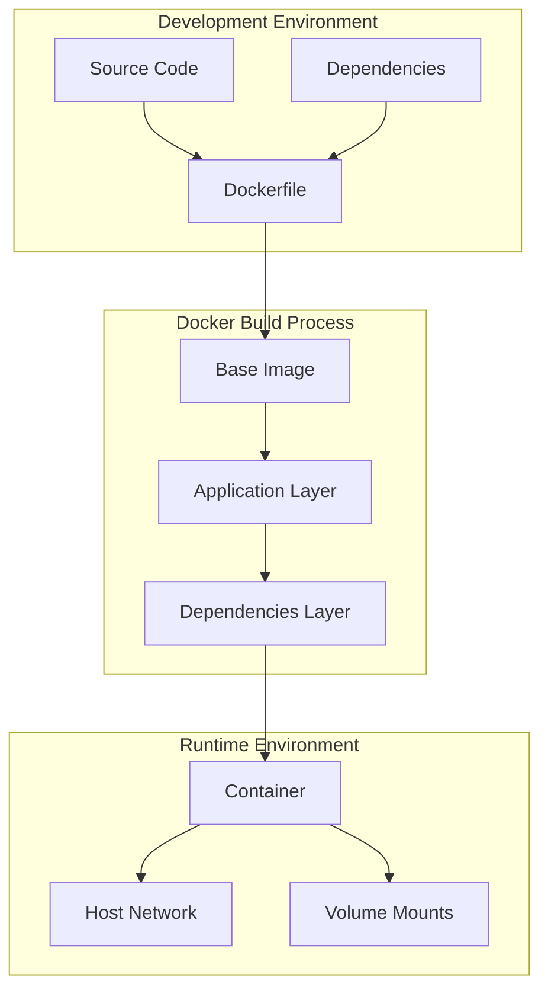

# 🐳 Custom Docker Image Creation Guide

[](https://github.com/TheToriqul/custom-docker-image)


## 📋 Project Overview

This project demonstrates my expertise in Docker containerization, focusing on creating and managing custom Docker images. Through hands-on implementation, I've developed a comprehensive understanding of Docker's architecture and best practices for containerizing Python applications. The project showcases a practical example of containerizing a Flask application, making it easily deployable and scalable.

## 🎯 Key Objectives

- Master Docker image creation using custom Dockerfiles
- Implement best practices for Python application containerization
- Understand Docker's layered architecture and optimization techniques
- Develop practical experience with Docker commands and operations
- Create production-ready container configurations

## 🏗️ Project Architecture

The project follows a layered architecture approach for containerizing Python applications:

### Component Overview


### Architecture Details

1. **Development Layer**
   - Source code (Python Flask application)
   - Dockerfile configuration
   - Requirements and dependencies

2. **Build Layer**
   - Multi-stage build process
   - Layer optimization
   - Image size minimization

3. **Runtime Layer**
   - Container orchestration
   - Network configuration
   - Volume management

4. **Operations Layer**
   - Monitoring and logging
   - Security implementation
   - Resource management

## 💻 Technical Stack

- **Base Image**: Python 3.9-slim
- **Framework**: Flask
- **Platform**: Docker CE
- **OS**: Ubuntu
- **Development Tools**: Docker CLI, pip

## 🚀 Getting Started

<details>
<summary>🐳 Prerequisites</summary>

- Ubuntu-based system
- Basic understanding of command line operations
- Internet connectivity for package downloads
- Sudo privileges for Docker installation

</details>

<details>
<summary>⚙️ Installation</summary>

1. Clone the repository:
   ```bash
   git clone https://github.com/TheToriqul/custom-docker-image.git
   ```
2. Navigate to the project directory:
   ```bash
   cd custom-docker-image
   ```
3. Run the Docker installation script:
   ```bash
   chmod +x install.sh
   ./install.sh
   ```

</details>

<details>
<summary>🎮 Usage</summary>

1. Build the Docker image:
   ```bash
   docker build -t my-python-app .
   ```
2. Run the container:
   ```bash
   docker run -p 4000:80 my-python-app
   ```

For detailed commands and explanations, refer to the [reference-commands.md](reference-commands.md) file.

</details>

## 💡 Key Learnings

### Technical Mastery:

1. Docker image creation and management
2. Container optimization techniques
3. Python application containerization
4. Docker networking and port mapping
5. Container security best practices

### Professional Development:

1. Infrastructure as Code principles
2. Container orchestration fundamentals
3. DevOps best practices
4. System administration skills
5. Documentation and technical writing

### 🔄 Future Enhancements

<details>
<summary>View Planned Improvements</summary>

1. Multi-stage builds for smaller image size
2. Implementation of Docker Compose
3. Container health monitoring
4. CI/CD pipeline integration
5. Kubernetes deployment configuration
6. Advanced security hardening
</details>

## 🙌 Contribution

Contributions are welcome! Feel free to [open an issue](https://github.com/TheToriqul/custom-docker-image/issues) or submit a [pull request](https://github.com/TheToriqul/custom-docker-image/pulls) to suggest improvements or add features.

## 📧 Connect with Me

- 📧 Email: toriqul.int@gmail.com
- 📱 Phone: +65 8936 7705, +8801765 939006
- 🌐 LinkedIn: [@TheToriqul](https://www.linkedin.com/in/thetoriqul/)
- 🐙 GitHub: [@TheToriqul](https://github.com/TheToriqul)
- 🌍 Portfolio: [TheToriqul.com](https://thetoriqul.com)

Let's connect and discuss all things Docker and beyond!

## 👏 Acknowledgments

- [Poridhi](https://poridhi.io/) for providing comprehensive labs and inspiring this project 
- [Docker Documentation](https://docs.docker.com/) for comprehensive resources
- [Python Docker Hub](https://hub.docker.com/_/python) for official Python images
- [Flask Documentation](https://flask.palletsprojects.com/) for web application framework guidance

---

Thank you for visiting this repository! I hope you find these Docker containerization insights valuable. Happy containerizing! 🚀